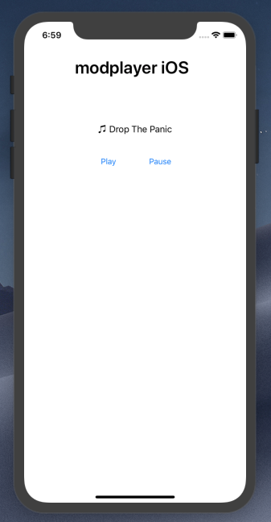

# modplayer-ios
Basic iOS protracker module player

This is a quick and dirty Swift port of [modplayer-js](https://github.com/warpdesign/modplayer-js), a JavaScript audioWorklet based Protracker player I have written a few years ago.

It's entirely written in Swift 5+ and is based on AVFoundation.

The AudioUnit class is more or less a direct port of the Objective-C class done by [Ronald Nicholson](https://github.com/hotpaw2/auv3test5).
